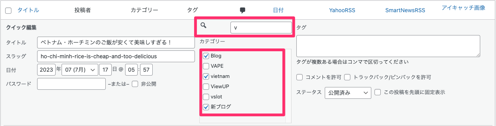

# Quick Edit Category Search WordPress Plugin

このプラグインは、WordPressのクイック編集メニューにカテゴリー検索を追加します。

## Description

Quick Edit Category Search プラグインを使用すると、投稿のクイック編集メニューでカテゴリーを素早く検索し、絞り込むことができます。これにより、大量のカテゴリーがあるサイトでも特定のカテゴリーを素早く見つけることができます。

## Installation

1. プラグインディレクトリに `quick-edit-category-search` フォルダをアップロードします。
2. WordPressの「プラグイン」メニューからプラグインを有効化します。

## Usage

1. 投稿の一覧ページに移動します。
2. 編集したい投稿の「クイック編集」をクリックします。
3. プラグインにより追加された検索ボックスにカテゴリー名を入力します。
4. 検索結果に基づいてカテゴリーチェックリストが動的に更新されます。

## Changelog

### 1.0
* 初版リリース
